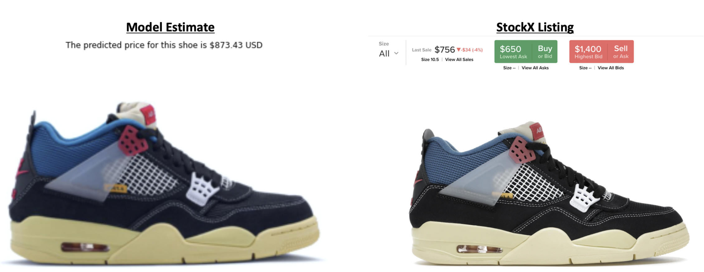
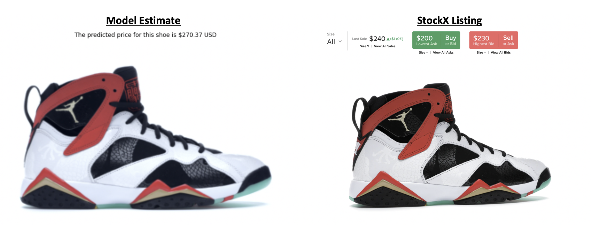
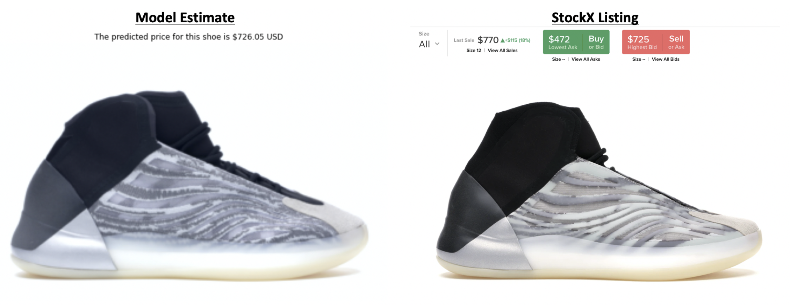

# Sneaker Resell Predictor

Lervaging the extensive data from popular fashion and resell platforms, I developed a sneaker resell predictor in Pytorch using the VGG16 model to perform price regression analysis based on sneaker image data. 

* Medium article: https://bit.ly/2H84ILg

# How to use:
* The workbook folder contains the "3. sneaker_ml_testing" workbook which you can follow for a more illutrative model prediction.
* For command line implementation, just call the prediction.py file with the image of your sneaker
* make sure the best_model_vgg_nf.pth file if save in the same directory

# Results:
Final test validation loss of 34k, representing an average prediction error of $184 or ~30% error

